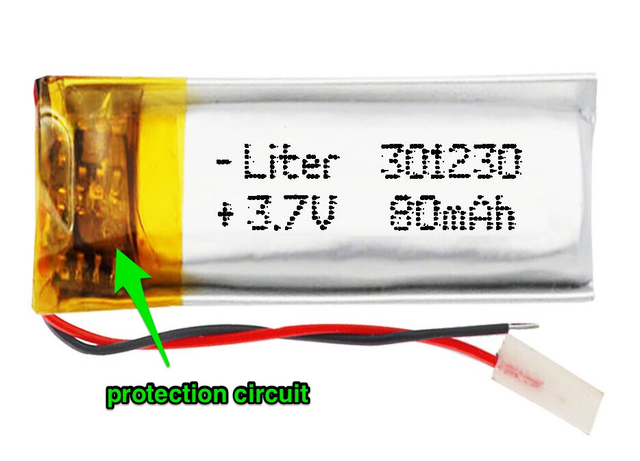
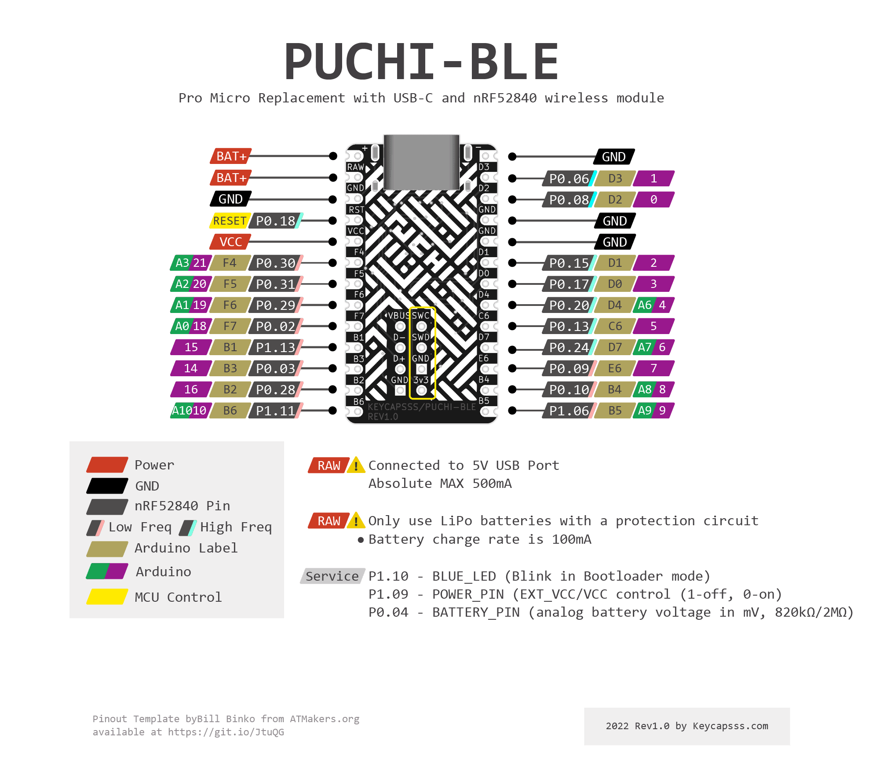
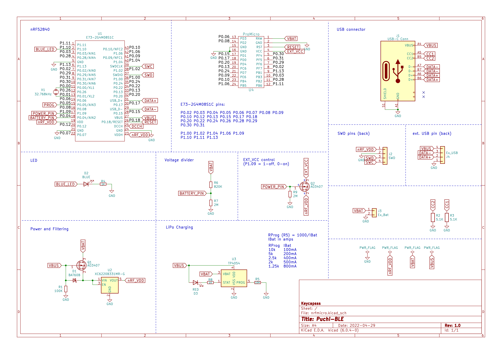

# Puchi-BLE

[](https://github.com/firstcontributions/first-contributions) [](https://discord.gg/frjFXZB "Redirect to Keycapsss Discord") [](https://creativecommons.org/licenses/by-nc-sa/4.0/)

## ToDo

__Please help to improve this guide. Edit the page [here](https://github.com/Keycapsss/puchi-ble/edit/main/README.md).__

- [ ] Status Led‘s (blue solid state)
- Bootloader
  - [x] Which and what changes
  - [x] How to enter bootloader mode
- [x] Pinout
- [x] How to compile/use [ZMK](https://zmk.dev/)
- [x] Create a ZMK Puchi-BLE board
- [ ] How to compile/use QMK [nrf52 fork](https://github.com/sekigon-gonnoc/qmk_firmware/tree/nrf52)
- [x] How to flash a firmware
- [x] What batteries are supported

## Battery (read carefully)

- Puchi-BLE supports 1S LiPo batteries (4.2V)
- Only use LiPo batteries with a protection circuit, because the Puchi-BLE has no low voltes (discharge) protection for batteries 
- A 301230 (3.0 x 12 x 30 mm) LiPo battery fit between 4.5mm tall pin sockets
- Connect the battery to B+ (red) and B- (black ), or RAW (red) and GND (black) (these pairs of pins are internally connected)
- __Avoid reverse polarity__ (nRF52840 chip is usually destroyed first)
- __Note that a few keyboards have RAW and VCC pins connected together (namely Helix and Gherkin), and will kill the controller__ (RAW pin is for the charger only). You may just not solder RAW pin to the keyboard as a workaround.

> I don't offer LiPo batteries in the shop, because of the German strict law.

## Bootloader

A customized [Adafruit nRF52 Bootloader](https://github.com/adafruit/Adafruit_nRF52_Bootloader/releases) is flashed on the Puchi-BLE.

[Here](https://gist.github.com/joric/7226eda8d5fdba44bc64d4520825a11d) you can find the changes from the original Adafruit nRF52 Bootloader.

The Bootloader binary already contain the Bluetooth stack (a.k.a SoftDevice).

### How to enter the bootloader mode

Press RESET (short RST with GND) twice within 500ms.  
The blue led will start slowly dimming and a Mass Storage (NRF52BOOT) should appear in your file explorer.

Now you can copy the ZMK UF2 firmware file on it.
After copying the UF2 file to the Mass Storage, the Puchi-BLE will automatically reboot and load the new firmware.

## Status Led's

- Red solid: power connected
- Blue 2x blinking: restart
- Blue slow flashing (every 3sec): ~~waiting for bluetooth connection~~
- Blue fast flashing:
- Blue off: ~~connected via bluetooth~~
- Blue slow dimming: USB Mass Storage mode, for firmware update
- Blue solid: ?

## Firmware

### ZMK

[Setup local ZMK environment](https://zmk.dev/docs/development/) (with VS Code & Docker is the easiest), or use the [Github action method](https://zmk.dev/docs/user-setup).

Build UF2 firmware file for Corne left side ...

```bash
west build -p -d build/left -b puchi_ble_v1 -- -DSHIELD=corne_left
```

After a successful build, you can find the UF2 firmware file in the `app/build/left/zephyr/zmk.uf2` folder.

... and right side.

```bash
west build -p -d build/right -b puchi_ble_v1 -- -DSHIELD=corne_right
```

More information about 'Building For Split Keyboards' [here](https://zmk.dev/docs/development/build-flash#building-for-split-keyboards).

[Here](https://github.com/Keycapsss/puchi-ble/tree/main/firmware) you can find the precompiled firmware files (UF2) for the Corne and Lily58 keyboard.

### QMK (nrf52 branch)

[Detailed documentation](https://github.com/joric/nrfmicro/wiki/QMK) by Joric

## Pinout



### Controller pinout comparison

| Puchi-BLE | nRFMicro 1.3+ | nice!nano | ProMicro | Left  | Right | ProMicro | nice!nano | nRFMicro 1.3+ | Puchi-BLE |
|:---------:|:-------------:|:---------:|:--------:|:-----:|:-----:|:--------:|:---------:|:-------------:|:---------:|
| P0.06     | P0.06         | P0.06     | D3       | PIN1  | PIN24 | RAW      | RAW       | RAW           | RAW       |
| P0.08     | P0.08         | P0.08     | D2       | PIN2  | PIN23 | GND      | GND       | GND           | GND       |
| GND       | GND           | GND       | GND      | PIN3  | PIN22 | RST      | P0.18     | P0.18         | P0.18     |
| GND       | GND           | GND       | GND      | PIN4  | PIN21 | VCC      | VCC       | VCC           | VCC       |
| P0.15     | P0.15         | P0.17     | D1       | PIN5  | PIN20 | F4       | P0.31     | P0.30         | P0.30     |
| P0.17     | P0.17         | P0.20     | D0       | PIN6  | PIN19 | F5       | P0.29     | P0.31         | P0.31     |
| P0.20     | P0.20         | P0.22     | D4       | PIN7  | PIN18 | F6       | P0.02     | P0.29         | P0.29     |
| P0.13     | P0.13         | P0.24     | C6       | PIN8  | PIN17 | F7       | P1.15     | P0.02         | P0.02     |
| P0.24     | P0.24         | P1.00     | D7       | PIN9  | PIN16 | B1       | P1.13     | P1.13         | P1.13     |
| P0.09     | P0.09         | P0.11     | E6       | PIN10 | PIN15 | B3       | P1.11     | P0.03         | P0.03     |
| P0.10     | P0.10         | P1.04     | B4       | PIN11 | PIN14 | B2       | P0.10     | P0.28         | P0.28     |
| P1.06     | P1.06         | P1.06     | B5       | PIN12 | PIN13 | B6       | P0.09     | P1.11         | P1.11     |

### Service Pins

- P0.18 - RESET
- P1.10 - BLUE_LED (P0.15 on nice!nano)
- P1.09 - POWER_PIN (EXT_VCC control, P0.13 on nice!nano) (1-off, 0-on)
- P0.04 - BATTERY_PIN (analog battery voltage in mV, 820kΩ/2MΩ)

### Low drive (low frequency) pins

P0.31, P0.29, P0.02, P1.15, P1.13, P1.10, P0.30, P0.28, P0.03, P1.14, P1.12, P1.11, P0.10, P0.09, P1.07, P1.06, P1.05, P1.04, P1.03, P1.02, P1.01

### Normal (high frequency) pins

P0.00, P0.01, P0.26, P0.27, P0.04, P0.05, P0.06, P0.07, P0.08, P1.08, P1.09, P0.11, P0.12, P0.14, P0.16, P0.18, P0.19, P0.21, P0.23, P0.25, P0.13, P0.15, P0.17, P0.20, P0.22, P0.24, P1.00

Detailed pin information can be found on the [Nordic Infocenter](https://infocenter.nordicsemi.com/topic/ps_nrf52840/pin.html?cp=4_0_0_6_0_1#qfn48).

## Schematic



## FAQ

- Do i need a TRRS cable to connect the split keyboard halfs?
  - No, the slave side connects wireless to the master side. Optional you can use a cable (no charge over TRRS cable).
- What's the battery life?
  - Approximately 2weeks with a 100mAh battery (no oled, or led‘s).
- Is there a lag while typing?
  - Bluetooth devices can reach a latency of 1.3 ms. Lower latency means more power drain and reduce the battery life.
- Is it possible to switch between Bluetooth devices?
  - Yes, QMK and ZMK have support for up to 5 Bluetooth profiles.
- What batteries work with the Puchi-BLE?
  - LiPo batteries with 1S. Also important is that the LiPo batterie has a protection circuit
- Are batteries available in the shop?
  - No, due to the german law, i don’t offer batteries in the shop. You can get LiPo batteries on Ebay and Aliexpress.
- What are the EXT_VCC and EXT_GND? Are they the same pins as VCC and GND?
  - Yes. Power output is sofware-controlled to save battery (RGB LEDs draw up to 1 mA each when off).
